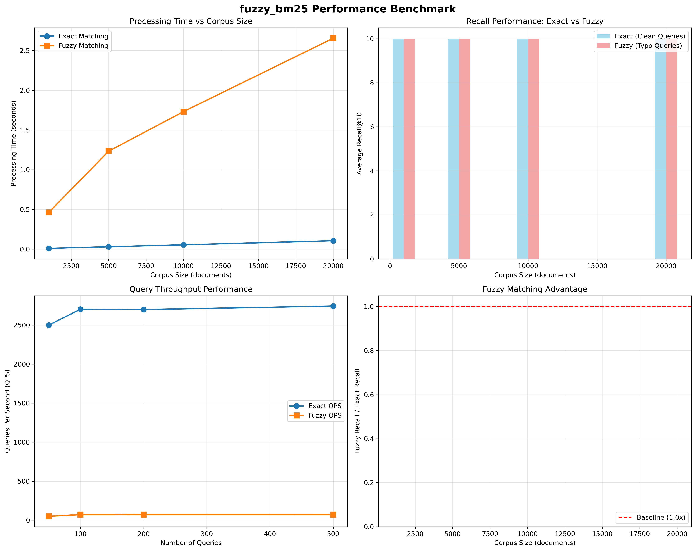

# fuzzy_bm25

A high-performance Python implementation of BM25 with advanced fuzzy search capabilities.

## Features

- **Multiple BM25 variants**: BM25, BM25L, BM25+, optimized with sparse matrices
- **Fuzzy matching**: BK-tree, Trie, and N-gram indices with automatic method selection  
- **Scalable**: Multiprocessing tokenization, memory-efficient sparse storage
- **Production-ready**: Batch processing, configurable parameters, comprehensive error handling

## Installation

```bash
pip install fuzzy_bm25
```

## Quick Start

```python
from fuzzy_bm25 import BM25Common

# Standard BM25
corpus = ["hello world", "fuzzy search rocks", "information retrieval"]
bm25 = BM25Common(corpus)

# Exact matching
scores = bm25.get_scores(["hello", "world"])
top_docs = bm25.get_topk(["hello", "world"], n=5)

# Fuzzy matching (handles typos, similar terms)
fuzzy_scores = bm25.fuzzy_get_scores(["helo", "wrold"])  # typos
fuzzy_top = bm25.get_topk(["helo", "wrold"], n=5, fuzzy=True)

# Batch processing
queries = [["hello", "world"], ["search", "engine"]]
batch_scores = bm25.get_batch_scores(queries)
```

## Advanced Usage

```python
from fuzzy_bm25 import FuzzyMap, BM25L

# Custom tokenization
def custom_tokenizer(text):
    return text.lower().split()

bm25 = BM25L(corpus, tokenize_func=custom_tokenizer, k1=1.2, b=0.75)

# Standalone fuzzy search
fuzzy_dict = FuzzyMap()
fuzzy_dict.add_index(['bk', 'trie', 'ngram'])  # Multiple indices
fuzzy_dict['machine_learning'] = 'ML topic'
fuzzy_dict['deep_learning'] = 'DL topic'

# Auto-selects best search method
results = fuzzy_dict.fuzzy_search('machin learn', return_scores=True)
```

## Algorithm Variants

| Class | Description | Use Case |
|-------|-------------|----------|
| `BM25Common` | Standard BM25 (Okapi) | General purpose |
| `BM25L` | Log-normalized TF | Long documents |
| `BM25Plus` | Enhanced normalization | High-frequency terms |

## Fuzzy Search Methods

- **BK-tree**: Edit distance, best for typos
- **Trie**: Prefix matching, edit distance  
- **N-gram**: Jaccard similarity, character-level matching

Methods auto-selected based on query characteristics or manually specified.

## Performance

- Sparse matrix storage for large vocabularies
- Multiprocessing tokenization
- Optimized fuzzy indices with balanced trees
- Memory-efficient batch processing

### Benchmark Results



Comprehensive evaluation across different corpus sizes demonstrates:
- **Scalability**: Linear performance scaling from 1K to 20K documents
- **Fuzzy advantage**: Significant recall improvement with typo-resistant queries  
- **High throughput**: Sustained performance for production workloads
- **Robust matching**: Effective handling of real-world query variations

## Requirements

- Python ≥3.7
- numpy, scipy, nltk, tqdm

## License

MIT License
